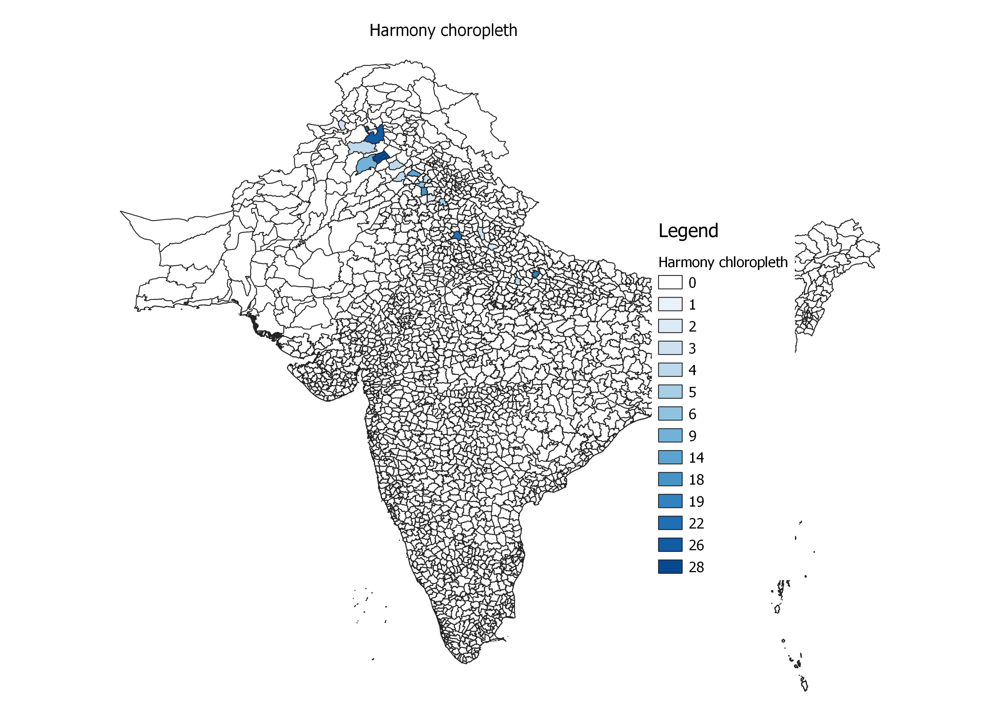
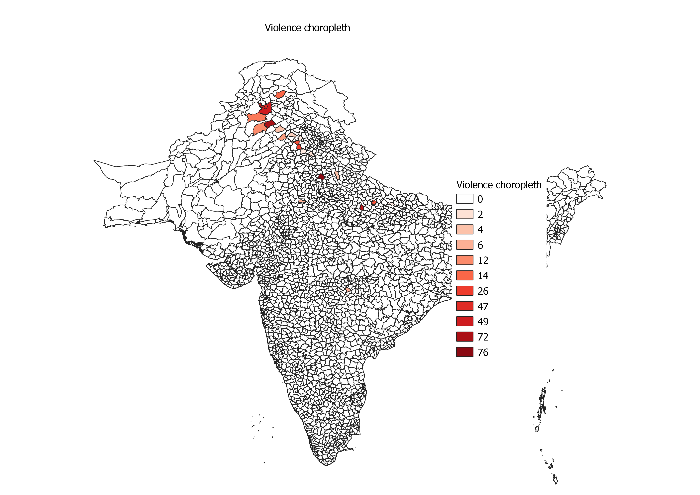

```{r setup, include=FALSE}
knitr::opts_chunk$set(echo = TRUE)
```

# Storytelling with Maps

## Introduction

The partition of British India in 1947 into India and Pakistan was done based on district-wide non-Muslim or Muslim majorities. The partition displaced between 10 and 20 million people along religious lines, creating overwhelming refugee crises in the newly constituted dominions. There was large-scale violence, with estimates of the loss of life accompanying or preceding the partition disputed and varying between several hundred thousand and two million. The violent nature of the partition created an atmosphere of hostility and suspicion between India and Pakistan that affects their relationship to this day.

The common perception in India is that people in Pakistan are inherently more violent. Similarly, one can assume that the common perception among Pakistanis is the same about Indians. I use partition data analysis and find out whether any of these perceptions have any merit by mapping the events of violence available in the database and comparing it to the events of harmony to understand the areas of violence and harmony, at least around the partition period

## Question

Are certain regions in British India more violent than the others? Are certain regions more harmonious than the others?  What are those regions? Or is there a correlation between the two? What may explain the violence or harmony in those particular regions?

## Hypothesis

I hypothesize that there would be proportional events of violence and also harmony on both sides of the partition with higher instances of events of violence around the India-Pakistan border or the active areas of conflict back then due to the volatile situation in those regions.

## Desired maps

Both, events of violence and harmony would be equivalent on both sides of the India-Pakistan border with the density of events of violence being greater near the border or the areas of active conflict and the intensity of colors would be fading away as we go further from these regions. The areas of conflict and the regions of harmony I would expect to be significantly distant on the maps.

## Generated maps




## Analysis

Some aspects of the above maps indicate almost the opposite of what I hypothesized before making these maps. Unlike the common perception in India, there is a lot more red in the region of Pakistan than in the Indian region. This seems to indicate that there was a lot more violence in what is now Pakistan than in India during partition. People in India may think that India was more affected by the partition but the violence choropleth indicates otherwise. However, the harmony choropleth, implying that there was more harmony in India than there was in Pakistan - is in direct contradiction to the violence choropleth.

What these maps also indicate is that the regions of violence and harmony were coinciding significantly. What this may imply is that there were certain regions where even during partition, there was not much happening - both with respect to violence and harmony. Also, in the regions where there were instances of violence, there were also instances of harmony and where there were instances of harmony, there were also cases of conflict. Human tendency is to classify anything into binaries and so, we usually prefer calling certain regions as violent and others as peaceful. However, these maps suggest we need to rethink that logic!

What was expected was that the intensity of color in both the maps would be fading away as the distance from the areas of high activity and border during partition, with the intensity of red being high around areas known for conflict.

## Reflection

QGIS has luckily been quite non-buggy for me as I was able to do all the operations I wanted to as and when I wanted to relatively simply and quickly. However, there were some instances where I could not find certain buttons or tools used in some documentations, either provided by the professor or online documentation. This is probably due to the changes in the locations of the QGIS for different updates in the software. For instance, the print composer was New Print Layout in this version of QGIS. Having said that, these were minor technical issues which though required some searching, were quite easy to find.

Coming to the problems with these maps, choropleths as discussed in class can prove to be quite misleading. For instance, if there is a district so small that we cannot see the difference in the red color in India when compared to a different district in Pakistan a lot bigger with the same number of events of conflict, it would lead us to believe that there was more violence in Pakistan. The data itself has been entered from a series of stories where the authors tend to talk about certain areas more than the others. This in turn means that even though there may be several moments of harmony or violence in certain parts of the countries, they won’t be shown. Also, since the authors primarily mention certain locations, the maps generated using this data can be quite misleading.

In terms of possibilities, any time where we need to understand the trend of something in a particular region and have the respective geolocations, QGIS can prove to be very helpful. Instead of looking at a csv file with random numbers, it is much more appealing to the reader if it is a graphic explaining the trend.